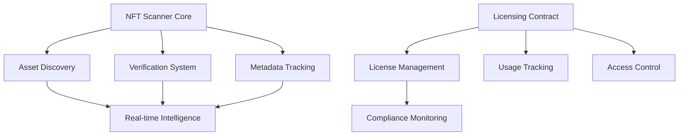

# SFT Instant Scanner

A decentralized NFT scanning and tracking platform on the Stacks blockchain, enabling real-time asset discovery and verification.

## Overview

SFT Instant Scanner provides a comprehensive solution for:
- Real-time NFT scanning and tracking
- Instant asset verification
- Comprehensive metadata analysis
- Cross-collection intelligence gathering

## Features

- Rapid NFT collection scanning
- Detailed asset metadata extraction
- Instant verification mechanisms
- Flexible tracking and analysis tools

## Contract Architecture



## Getting Started

### Prerequisites
- Clarinet
- Stacks wallet
- STX tokens for transactions

### Basic Usage

1. Scan an NFT collection:
```clarity
(contract-call? .nft-scanner-core scan-collection collection-id)
```

2. Verify asset metadata:
```clarity
(contract-call? .nft-scanner-core verify-asset asset-id)
```

3. Configure licensing parameters:
```clarity
(contract-call? .nft-scanner-licensing set-license-tier collection-id tier-params)
```

## Development

### Testing
```bash
clarinet test
```

### Local Development
```bash
clarinet integrate
clarinet deploy
```

## Security Considerations

- Atomic state changes
- Strict access control
- Comprehensive validation mechanisms
- Secure metadata handling

## Contributing

Contributions are welcome! Please submit pull requests or open issues for feature requests and bug reports.

## License

[Insert License Information]